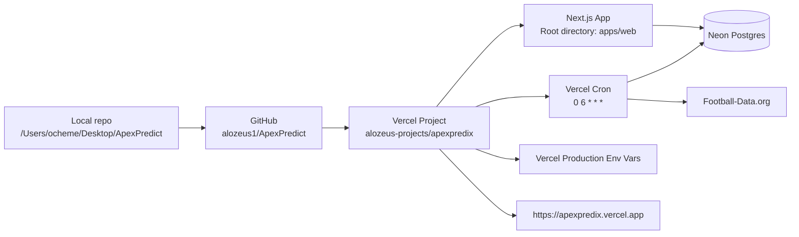
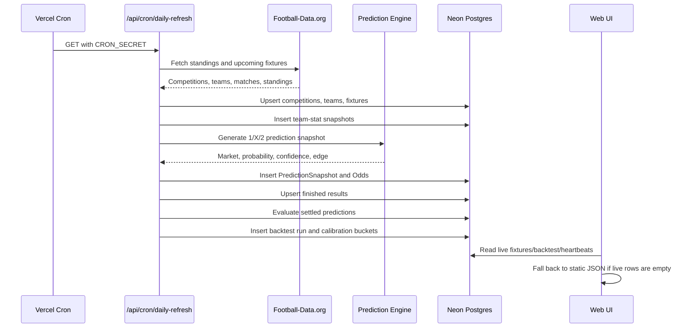

# ApexPredict Engineering Handoff

Date: 2026-06-03  
Product owner: Web Forx Global Inc  
Repository: `alozeus1/ApexPredict`  
Production URL: `https://apexpredix.vercel.app`  
Vercel project: `alozeus-projects/apexpredix`  
Current production commit: `b8cb85f`  

## 1. Executive Summary

ApexPredict, deployed publicly as ApexPredix, is a sports prediction intelligence web application being positioned as a subscription product owned and operated by Web Forx Global Inc. The current product is a Next.js web app with a live-data ingestion layer, a prediction engine, a rolling backtest/evaluation loop, compliance gates, multilingual marketing pages, and waitlist capture.

The app is now deployed and responding in Vercel production. The database schema has been migrated in Neon, required production environment variables are configured in Vercel, and the protected daily refresh endpoint has been manually verified.

The application is not yet enterprise-ready for paid subscribers. It is a working foundation and product prototype with the initial prediction workflow in place. The next engineering phase should focus on auth, subscription billing, real odds providers, stronger prediction models, observability, admin tooling, legal/compliance review, and production operational controls.

## 2. Current Verified Production Status

### Git and Deployment

- Latest pushed commit: `b8cb85f fix(deploy): include prisma engine in serverless bundle`
- Local branch: `main`
- Remote branch: `origin/main`
- Vercel production deployment: `dpl_9jWJKWPH5auZwLBqZxhZtMtQzcr1`
- Production alias: `https://apexpredix.vercel.app`

### Verification Completed

Local verification:

```bash
pnpm -F @apexpredix/web typecheck
pnpm -F @apexpredix/web test
pnpm -F @apexpredix/web build
```

Results:

- Typecheck passed.
- Unit/component tests passed: 26 test files, 48 tests.
- Local production build passed on Next.js `15.5.19`.

Production verification:

```bash
curl -I https://apexpredix.vercel.app/en
curl -I https://apexpredix.vercel.app/en/predictions
curl -s https://apexpredix.vercel.app/api/health
curl -s https://apexpredix.vercel.app/api/waitlist/count
```

Observed:

- `/en` returns HTTP `200`.
- `/en/predictions` returns HTTP `200`.
- `/api/health` returns `ok: true` and build hash `b8cb85f...`.
- `/api/waitlist/count` returns `ok: true`.

Protected daily refresh verification:

```bash
GET /api/cron/daily-refresh
Authorization: Bearer $CRON_SECRET
```

Observed response:

```json
{
  "ok": true,
  "fixturesWritten": 0,
  "predictionsWritten": 0,
  "resultsWritten": 0,
  "statsWritten": 132,
  "evaluatedNow": 0
}
```

Interpretation:

- Football-Data credentials work.
- Prisma can connect in Vercel serverless runtime.
- The cron route can write to Neon.
- Standings/team-stat ingestion wrote 132 rows.
- No upcoming fixtures were returned in the current provider window, so no live fixture/prediction rows were created during the manual run. The UI falls back to demo fixture data when live fixtures are empty.

## 3. Product Description

ApexPredict is intended to be a Web Forx Global Inc product that helps users review sports predictions, model confidence, value-bet signals, and rolling backtest performance before making decisions. It should be positioned as an analytics and intelligence platform, not as a gambling operator.

Current product surfaces:

- Multilingual public landing pages.
- Predictions feed.
- Match detail pages.
- Methodology content.
- Backtest metrics section.
- Agent/network activity grid.
- Premium/subscription marketing page.
- Waitlist signup and verification flow.
- Legal pages and compliance messaging.
- Region and age/compliance gates.

Current prediction scope:

- Soccer-first.
- Football-Data.org ingestion for standings, fixtures, and results.
- 1/X/2 prediction engine.
- Rolling backtest/evaluation metrics.

Deferred commercial scope:

- Authenticated user accounts.
- Paid subscriptions.
- User dashboards with saved picks.
- Real odds provider integration.
- Admin operations console.
- Production-grade observability and alerting.
- Legal review and region-specific compliance workflow.

## 4. Current Architecture

```mermaid
flowchart TB
  U[Public users] --> V[Vercel Edge / Next.js App Router]
  V --> PAGES[Marketing, Predictions, Match Detail, Premium, Legal Pages]
  V --> API[Next.js API Routes]

  API --> WAITLIST[/api/waitlist<br/>/api/waitlist/count<br/>/api/waitlist/verify]
  API --> HEALTH[/api/health]
  API --> CRON[/api/cron/daily-refresh]
  API --> OG[/api/og/match/:matchId]
  API --> CSP[/api/csp-report]

  CRON --> FD[Football-Data.org API<br/>X-Auth-Token]
  CRON --> ENGINE[Prediction Engine<br/>probability, confidence, edge]
  CRON --> BACKTEST[Backtest Evaluator<br/>ROI, hit rate, Brier, log loss, calibration]

  WAITLIST --> DB[(Neon Postgres)]
  CRON --> DB
  ENGINE --> DB
  BACKTEST --> DB

  PAGES --> DATA[Server data helpers]
  DATA --> DB
  DATA --> FALLBACK[Static demo JSON fallback]

  V --> ANALYTICS[Vercel Analytics / Speed Insights<br/>Sentry hooks configured]
```

## 5. Deployment Architecture



Deployment notes:

- Vercel project root is `apps/web`.
- `apps/web/vercel.json` contains the cron configuration.
- The root-level `vercel.json` was moved because Vercel ignored it when the project root was `apps/web`.
- Vercel production build command currently runs from repo root:

```bash
cd ../.. && pnpm -F @apexpredix/db generate && pnpm -F @apexpredix/web build
```

- Install command:

```bash
cd ../.. && pnpm install --frozen-lockfile
```

## 6. Environment Variables

Configured in Vercel Production:

- `DATABASE_URL`
- `DIRECT_URL`
- `CRON_SECRET`
- `FOOTBALL_DATA_API_TOKEN`
- `FOOTBALL_DATA_COMPETITIONS`

Important handling:

- Do not commit real values to the repo.
- `.env*` files are ignored by `.gitignore`.
- `DATABASE_URL` should use Neon pooled connection.
- `DIRECT_URL` should use Neon direct connection.
- `FOOTBALL_DATA_API_TOKEN` is used as `X-Auth-Token`.

Recommended additional production env vars to configure before launch:

- `NEXT_PUBLIC_SITE_URL=https://apexpredix.vercel.app` or the final custom domain.
- `HASH_SECRET_PRIMARY` with a strong random value.
- `RESEND_API_KEY` and `RESEND_FROM_ADDRESS`, or `SMTP_URL` / `SMTP_HOST` / `SMTP_USER` / `SMTP_PASS` plus `SMTP_FROM_ADDRESS`, for transactional email.
- `KV_REST_API_URL` and `KV_REST_API_TOKEN` for rate limiting.
- `SENTRY_DSN` and `NEXT_PUBLIC_SENTRY_DSN` for observability.
- `NEXT_PUBLIC_TURNSTILE_SITE_KEY` and `TURNSTILE_SECRET_KEY` for bot protection.

Security note:

- The Neon database credential and Football-Data token were pasted into chat during setup. Rotate both before commercial launch if this transcript is stored anywhere outside tightly controlled internal systems.

## 7. Database Schema

Database provider:

- Neon Postgres.

Prisma package:

- `packages/db`

Schema file:

- `packages/db/prisma/schema.prisma`

Applied migrations:

- `20260602_agentic_refresh`
- `20260603_core_app_tables`

Core app tables:

- `WaitlistSignup`
- `CookieConsent`
- `VerificationToken`
- `GeoBlockEvent`

Live-data and prediction tables:

- `Competition`
- `Team`
- `TeamStat`
- `Fixture`
- `Odds`
- `FixtureResult`
- `PredictionSnapshot`
- `PredictionEvaluation`
- `PredictionBacktestRun`
- `PredictionCalibrationBucket`
- `AgentHeartbeat`

Operational note:

The production database was initially non-empty but had no Prisma migration history. The first prediction migration was applied manually through `prisma db execute` and then marked as applied with `prisma migrate resolve`. After that, `prisma migrate deploy` works normally. Future migrations should use normal Prisma migration flow.

## 8. API Routes

### Public/system routes

- `GET /api/health`
  - Returns health status, current build hash, and timestamp.

- `GET /api/waitlist/count`
  - Returns public waitlist count.
  - Uses DB if available.
  - Falls back to baseline count.

- `POST /api/waitlist`
  - Creates or updates waitlist signup.
  - Uses hashed IP/user-agent metadata.
  - Sends verification email when email provider is configured.

- `GET /api/waitlist/verify`
  - Verifies waitlist signup token.

- `POST /api/consent`
  - Stores cookie consent choices.

- `POST /api/csp-report`
  - Receives CSP reports.

- `GET /api/og/match/[matchId]`
  - Generates Open Graph image for match pages.

### Protected workflow route

- `GET /api/cron/daily-refresh`
  - Requires `Authorization: Bearer $CRON_SECRET`.
  - Runs fixture sync, standings sync, prediction generation, result settlement, backtest evaluation, and agent heartbeats.
  - Vercel Cron schedule: daily at `06:00 UTC`.

## 9. Data and Prediction Workflow



Current prediction engine:

- Uses standings features:
  - points pace
  - goal difference
  - table position
  - home edge
  - market-implied probability when odds exist
- Produces:
  - market: `1`, `X`, or `2`
  - probability
  - confidence
  - edge
  - fair/model odds when no external odds provider exists
  - narrative explanation

Current backtest engine:

- Evaluates settled predictions once results exist.
- Tracks:
  - hit rate
  - ROI
  - total staked
  - total returned
  - net profit
  - average confidence
  - average edge
  - Brier score
  - log loss
  - calibration error
  - calibration buckets

Current limitation:

- This is not a mature predictive model yet. It is an initial calibrated baseline and feedback loop. It should be improved with richer features, odds history, injuries, lineups, xG feeds, market movement, model comparison, and continuous monitoring.

## 10. Current UI Behavior

Predictions:

- Server helper: `apps/web/lib/data/get-fixtures.ts`
- Reads live `Fixture` rows first.
- Falls back to `apps/web/data/fixtures.json` if DB is unavailable or there are no live upcoming fixtures.

Match detail:

- Server helper: `apps/web/lib/data/get-match.ts`
- Supports live match IDs in the format `live-{externalId}`.
- Supports static demo match IDs.

Agent network:

- Server helper: `apps/web/lib/data/get-agents.ts`
- Reads latest `AgentHeartbeat` rows.
- Falls back to `apps/web/data/agents.json`.

Backtest:

- Server helper: `apps/web/lib/data/get-backtest-metrics.ts`
- Reads latest `PredictionBacktestRun`.
- Falls back to zeroed "awaiting settled predictions" metrics.

## 11. Known Warnings and Current Limitations

### Build warnings

Current build warnings that should be cleaned up:

- `HeroReel.tsx` uses `` instead of Next `<Image />`.
- `metadataBase` is not set, so Next defaults OG/Twitter URL resolution to localhost during build.
- `@playwright/test` has a peer warning with newer Next tooling expectations.

### Product limitations

- No user authentication yet.
- No Stripe subscription billing yet.
- No account-level subscription entitlements.
- Dashboard is still demo/locked.
- No admin console.
- No real paid odds provider.
- Football-Data free tier does not provide the full data quality needed for a premium sports betting intelligence product.
- Current model is a baseline, not an enterprise-grade prediction engine.
- No model versioning UI.
- No model drift alerts.
- No human review/override workflow.
- No proper A/B testing or growth analytics layer.
- No custom production domain configured yet.
- No formal legal review completed.

### Operational limitations

- Vercel Hobby cron supports daily cadence. Sub-daily cron requires a higher Vercel plan or an external scheduler.
- The cron route is a single large workflow. Enterprise readiness should split ingestion, settlement, prediction generation, backtesting, and alerting into independent durable jobs.
- No retry queue or dead-letter queue.
- No structured operational logs dashboard.
- No alerting on failed cron runs.
- No run history UI.

## 12. Enterprise Readiness Roadmap

### Phase 1: Stabilize Current Production Foundation

Priority: immediate.

Tasks:

- Rotate Neon and Football-Data credentials.
- Set final `NEXT_PUBLIC_SITE_URL`.
- Configure Sentry DSN.
- Configure production email provider and verify waitlist emails.
- Configure Turnstile keys.
- Configure Vercel KV for rate limiting.
- Fix `metadataBase`.
- Replace `` in `HeroReel` with Next `<Image />`.
- Add smoke tests for production URLs.
- Add CI workflow for typecheck, tests, build, and migrations.
- Add deployment checklist.

Definition of done:

- Build has no high-severity warnings.
- All required env vars are documented and configured.
- Production smoke tests pass after deploy.
- Failed cron sends an alert.

### Phase 2: Commercial Subscription Platform

Priority: high.

Tasks:

- Add authentication.
- Add account model.
- Add organization/user subscription model.
- Integrate Stripe Checkout and Customer Portal.
- Add subscription plans and entitlement checks.
- Convert Premium page into real upgrade flow.
- Build user dashboard for saved picks and tracked outcomes.
- Add billing webhooks.
- Add cancellation/dunning flows.

Definition of done:

- User can sign up, subscribe, access premium predictions, and manage billing.
- Non-paying users cannot access premium features.
- Subscription state is synced from Stripe webhooks.

### Phase 3: Data Quality and Provider Expansion

Priority: high.

Tasks:

- Add real odds provider:
  - The Odds API
  - OddsJam
  - SportRadar
  - API-Football
- Store odds snapshots over time.
- Track opening, current, and closing odds.
- Add provider abstraction with health checks.
- Add provider quota monitoring.
- Add fallback provider routing.
- Add data freshness badges in UI.

Definition of done:

- Every prediction can show current market odds and model edge.
- Odds and fixture data have freshness timestamps.
- Provider failures are visible and alertable.

### Phase 4: Prediction Model Upgrade

Priority: high.

Tasks:

- Add model versioning.
- Add feature store or feature snapshot tables.
- Add richer soccer features:
  - ELO
  - recent form
  - xG
  - home/away splits
  - injuries
  - lineups
  - rest days
  - travel distance
  - head-to-head
  - market movement
- Add separate models:
  - ELO model
  - Poisson goals model
  - market-implied baseline
  - ensemble model
- Add calibration layer:
  - Platt scaling or isotonic regression
  - probability bucket monitoring
- Add model comparison reports.

Definition of done:

- Prediction snapshots include model version and feature snapshot.
- Backtests can compare model versions.
- Calibration and ROI metrics can be tracked per model.

### Phase 5: Admin and Agent Operations

Priority: medium.

Tasks:

- Build admin dashboard.
- Show cron run history.
- Show provider status.
- Show failed jobs.
- Show ingestion counts.
- Show latest fixtures/predictions/results.
- Add manual rerun controls.
- Add override/review workflow.
- Add audit log.

Definition of done:

- Operators can diagnose stale predictions without reading logs.
- Admin actions are audited.

### Phase 6: Compliance and Legal Launch Prep

Priority: high before paid launch.

Tasks:

- Legal review of gambling-adjacent product language.
- Update disclaimers.
- Verify age gates and regional restrictions.
- Add responsible gambling resources by region.
- Add terms for subscription product.
- Add privacy policy for user accounts and analytics.
- Add data retention policy.
- Add security policy.
- Add refund/cancellation policy.

Definition of done:

- Legal/compliance approves launch copy and user flows.
- Product does not claim guaranteed winnings or near-perfect outcomes.

### Phase 7: Enterprise Hardening

Priority: medium/high.

Tasks:

- Add CI/CD with protected branches.
- Add preview deployments for PRs.
- Add migration checks.
- Add contract tests for providers.
- Add e2e tests for signup, subscription, and predictions.
- Add uptime monitoring.
- Add incident response runbook.
- Add backup/restore plan.
- Add rate limiting and abuse controls.
- Add secrets rotation policy.
- Add dependency vulnerability scanning.

Definition of done:

- Production release process is repeatable.
- Failures are observable.
- Recovery procedures are documented and tested.

## 13. Recommended Team Ownership

For Web Forx Global Inc, recommended engineering ownership:

- Product lead:
  - Owns roadmap, subscription packaging, launch criteria, pricing.

- Full-stack lead:
  - Owns Next.js app, API routes, auth, billing, UI integration.

- Data engineer:
  - Owns provider ingestion, schema, data freshness, odds history.

- ML/prediction engineer:
  - Owns model features, model versions, backtesting, calibration.

- DevOps/platform engineer:
  - Owns Vercel, Neon, CI/CD, monitoring, incident response.

- Compliance/legal reviewer:
  - Owns copy, disclaimers, regional restrictions, responsible gambling posture.

## 14. Immediate Next Actions for the Receiving Team

1. Rotate exposed setup credentials.
2. Confirm all Vercel env vars are set for Production and Preview.
3. Configure missing production env vars:
   - `NEXT_PUBLIC_SITE_URL`
   - `HASH_SECRET_PRIMARY`
   - `RESEND_API_KEY` or SMTP settings
   - `KV_REST_API_URL`
   - `KV_REST_API_TOKEN`
   - `SENTRY_DSN`
   - `NEXT_PUBLIC_SENTRY_DSN`
   - Turnstile keys
4. Add CI workflow.
5. Add Stripe/auth plan and implement account system.
6. Select paid odds/data provider.
7. Replace demo dashboard with real user dashboard.
8. Add admin operations console.
9. Improve model and backtesting with real historical odds/results.
10. Complete legal/compliance review before selling subscriptions.

## 15. Commands Reference

Install:

```bash
corepack enable
corepack prepare pnpm@9.12.0 --activate
pnpm install
```

Generate Prisma client:

```bash
pnpm -F @apexpredix/db generate
```

Apply migrations:

```bash
pnpm -F @apexpredix/db migrate:deploy
```

Run local verification:

```bash
pnpm -F @apexpredix/web typecheck
pnpm -F @apexpredix/web test
pnpm -F @apexpredix/web build
```

Run dev server:

```bash
pnpm -F @apexpredix/web dev
```

Deploy production:

```bash
vercel deploy --prod --yes
```

Invoke daily refresh manually:

```bash
curl -H "Authorization: Bearer $CRON_SECRET" \
  https://apexpredix.vercel.app/api/cron/daily-refresh
```

## 16. Final Assessment

The app is working as a deployed foundation:

- Vercel production deployment is ready.
- Public pages respond.
- Health API responds.
- Neon migrations are applied.
- Production env vars for database, cron, and Football-Data are configured.
- Protected daily refresh endpoint succeeds.
- Prediction engine and backtest persistence are implemented.

The app is not yet ready to sell as a subscription service. It needs commercial account infrastructure, payment integration, better data providers, stronger model validation, observability, legal review, and admin tooling before Web Forx Global Inc should launch it as a paid product.
