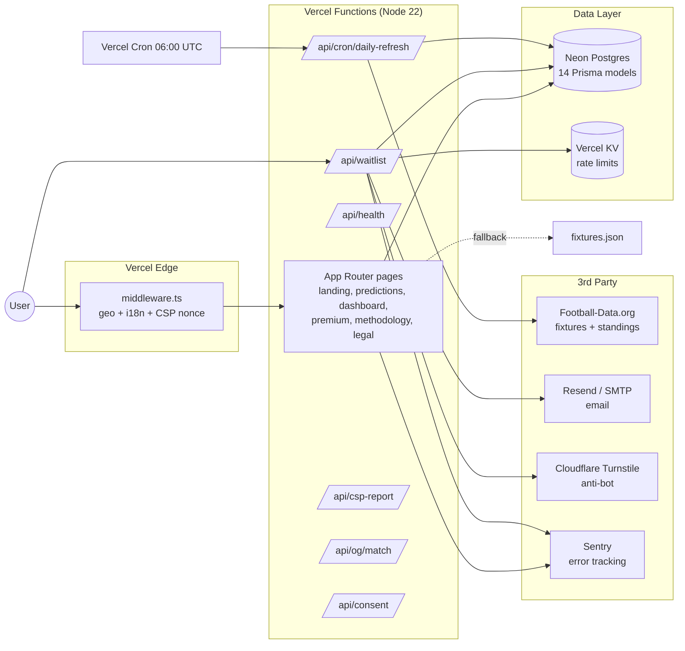
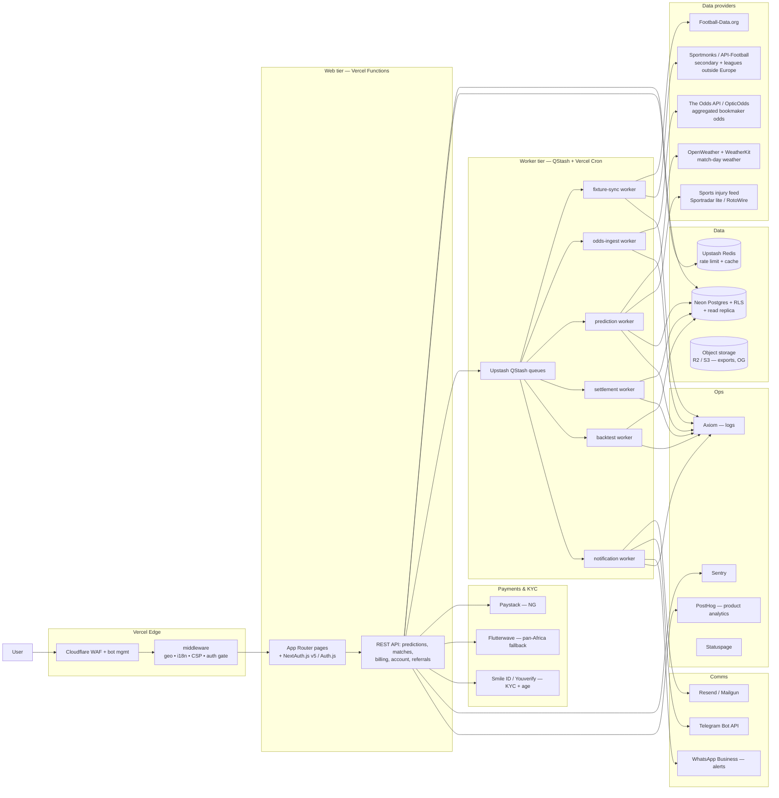

# ApexPredict — Strategic Audit, Architecture & MVP Plan

**Doc owner:** Engineering / Product (CTO + PM, Web Forx Global Inc)
**Reviewed:** 2026-06-04
**Audience:** Management, Engineering, Compliance, GTM
**Status:** v1 — recommended path to commercial launch

---

## 0. Recommended Solution (TL;DR)

ApexPredict is currently a **marketing site + waitlist + skeleton prediction job**, not a product. To win the Nigeria-first launch in 60 days we recommend:

1. **Re-position the engine as a *value-bet signal service*, not an oracle.** Calibrated probabilities + edge vs. live market — not a "very high win-ratio" promise. The latter is unachievable, unverifiable, and exposes WebForx to advertising-standards risk under NLRC.
2. **Wedge into the Nigerian market through three things competitors don't do well:** (a) explainable picks in English + Pidgin + Yoruba + Hausa, (b) live odds *comparison* across SportyBet, Bet9ja, 1xBet, BetKing & MSport so users find +EV lines, (c) a free 2–3 daily picks tier with a Paystack-billed Pro tier (₦2,500/wk, ₦8,000/mo, ₦70,000/yr).
3. **Replace the in-process cron with a queue + worker model** before any paid traffic — the current daily Vercel cron is a single point of failure that will time out at scale, and Football-Data.org is a single data source with strict 10 req/min limits.
4. **Ship a security & compliance baseline week 1** — no real users until NLRC permit pathway is clear, RG (responsible gaming) controls are in place, real auth + RLS, payment KYC, and audit logging are deployed.
5. **Budget for a Vercel Pro tier + Neon Scale plan + paid odds API.** Hobby+Free will not survive launch traffic, and scraping Nigerian sportsbooks for production-grade odds is brittle and ToS-violating.

If management accepts these five pivots, a 60-day public beta with paid tiers is achievable. Without them, the timeline is 90–120 days minimum or the launch ships fragile.

---

## 1. Repository State of the Union

### 1.1 Stack inventory

| Layer | Choice | Verdict |
|---|---|---|
| Framework | Next.js 15.5 (App Router) + React 19 | Solid. Keep. |
| Language | TypeScript 5.6, strict mode (assumed) | Keep. |
| Monorepo | pnpm 9 + Turborepo 2.3 | Keep. |
| Styling | Tailwind 3.4 + shadcn primitives + Framer Motion | Keep. |
| i18n | next-intl 3.26 (en, es, yo, ha, zu) | Good. Drop `es`/`zu` for v1, add `pcm` (Nigerian Pidgin). |
| DB | Prisma + Neon Postgres + citext | Keep. Need RLS + read replicas. |
| Email | Resend (Nodemailer SMTP fallback) | Keep. Add Mailgun fallback for Nigeria deliverability. |
| Anti-bot | Cloudflare Turnstile | Keep. |
| Rate limit | Vercel KV (`@vercel/kv`) | Keep. Needs broader coverage. |
| Observability | Sentry 8 + Vercel Analytics + Speed Insights | Keep. Add Logflare/Axiom for log retention. |
| Tests | Vitest + Playwright + axe-core + Lighthouse CI | Keep. CI workflow is dispatch-only — must activate. |
| Auth | **None** | Critical gap. |
| Payments | **None** | Critical gap. |
| Mobile | **None** (responsive web only) | OK for MVP; PWA installable; native app post-launch. |

### 1.2 Repo layout (verified)

```
apexpredict/
├── apps/web/                       Next.js app
│   ├── app/
│   │   ├── [locale]/               page, predictions, predictions/[id], premium, dashboard, methodology, how-it-works, legal, thank-you, blocked, under-age
│   │   ├── api/                    waitlist, waitlist/verify, waitlist/count, health, consent, csp-report, og/match, cron/daily-refresh
│   │   └── (dev)/dev/stills        Seedance hero-reel still capture
│   ├── components/                 sections, match, nav, compliance, reel, seo, analytics, motion
│   ├── lib/
│   │   ├── prediction-engine/      model.ts (117 LOC), backtest.ts (165 LOC)
│   │   ├── live-data/              football-data.ts (only data source)
│   │   ├── compliance/             blocklist, rgs, consent
│   │   └── (hash, rate-limit, cron-auth, email, seo, geo, analytics, disposable-email)
│   ├── data/                       fixtures, agents, pricing, bookmakers (Zod schemas)
│   ├── messages/                   en/es/yo/ha/zu i18n bundles
│   ├── content/legal/              privacy/terms/cookies/disclaimer .mdx
│   └── middleware.ts               geo-fence + locale + CSP nonce
├── packages/
│   ├── config/   shared tsconfig, eslint, tailwind preset, prettier
│   ├── types/    Match, Agent, PricingRegion, Bookmaker, Locale, etc.
│   ├── db/       Prisma schema (248 LOC, 14 models)
│   ├── ui/       Button, Input, cn util
│   └── email/    React Email templates (verify, welcome)
├── .forgejo/workflows/deploy.yaml  push-to-main → vercel deploy
├── .github/workflows/ci.yml        dispatch-only stub — not active
├── docs/superpowers/               existing spec + plan + DoD
└── vercel.json                     single daily cron at 06:00 UTC
```

### 1.3 What's actually built

- Marketing landing in 5 locales with hero reel placeholder, Methodology / Backtest / Premium / How-to-use sections.
- Waitlist signup with double opt-in (Resend), Turnstile, rate limit, HMAC-hashed IP/UA, disposable-email block.
- Predictions index + per-match detail rendered from Prisma (with `fixtures.json` fallback).
- A daily cron (`/api/cron/daily-refresh`) that: pulls fixtures + standings from Football-Data.org → upserts competitions/teams/team-stats/fixtures → generates a `PredictionSnapshot` per fixture from a small ensemble (ELO proxy + Poisson proxy + xG proxy, all driven by table position & points-per-game) → settles finished fixtures → runs a backtest (Brier, log-loss, calibration buckets, ROI) → writes agent heartbeats.
- Geo-fence middleware (CN, KP, IR, CU, SA, AE, SG, FR + 5 US states blocked → 451). **Nigeria is currently NOT blocked. ✅**
- Cookie consent + RGS banner + age gate.
- Sitemap, robots, manifest, OG image, JSON-LD SEO helper.

### 1.4 What is *not* built (the critical gaps)

| Area | State | Severity |
|---|---|---|
| User auth (login, sessions, password reset, OAuth) | Missing | **Blocker** |
| User schema in DB (`User`, `Account`, `Session`, `Subscription`) | Missing | **Blocker** |
| Subscription tiers + paywall enforcement | Premium features hardcoded "Unlocked" — fixtures/dashboard show demo numbers | **Blocker** |
| Payments (Paystack/Flutterwave) + webhooks + entitlement | Missing | **Blocker** |
| Real bookmaker odds | `Odds` table populated by *model's own fair price* labelled `MODEL` — there is no real bookmaker integration | **Blocker** |
| Multi-sport (basketball, tennis, cricket) | Football only | High |
| Injury / weather / lineup / referee features | None — only standings + form string | High (impacts prediction quality) |
| Live in-play prediction / odds drift | None | Medium |
| Push notifications (Telegram, email alerts) | Marketing copy only | Medium |
| Affiliate links to sportsbooks | Listed in `bookmakers.json` but no tracking | Medium |
| Admin console | None | Medium |
| Per-user pick tracking, P&L ledger | None (dashboard is hardcoded demo data) | High |
| RG controls (deposit limits, self-exclusion, cool-off) — *required for NLRC* | UI banner only | **Blocker** for paid launch |
| KYC / age verification (Smile ID / Youverify / VerifyMe NG) | Age-gate is a JS modal, easily bypassed | **Blocker** |
| Active CI on push/PR | `.github/workflows/ci.yml` is `workflow_dispatch` only | High |
| SAST / IaC / container / dependency scanning | None | High |
| Backup / DR plan for Neon | Default Neon snapshots only | Medium |
| WAF rules beyond Vercel default | Vercel default only | Medium |
| Audit log of admin/PII access | None | High (compliance) |
| Hero reel video assets | Missing (placeholder broken until rendered) | Low |

---

## 2. Blockers, Breakers & Loopholes

### 2.1 Critical security & compliance issues

**C-1 — No auth, dashboard is public demo data.** `/dashboard` shows hardcoded KPIs (89.3% win rate, +8.5% ROI). This will be screenshotted by competitors and used against us in regulator complaints. *Fix:* mark clearly as demo, hide behind login, replace with real per-user P&L before any paid sale.

**C-2 — Premium gating is cosmetic.** `/premium` page exists, but `Premium` section + dashboard panels label all features "Unlocked." There is no entitlement check. *Fix:* introduce `Subscription` model + middleware-level paywall before billing turns on.

**C-3 — Geo-fence blocks Saudi Arabia (SA) and Singapore (SG) but does NOT block several jurisdictions where unlicensed sports-betting marketing is risky.** Conversely, the blocklist includes France and US states (CT, HI, ID, TN, WA) — defensible — but is missing several relevant ones (e.g., Türkiye, China territories handled by `CN`, US ID is included but not UT). *Fix:* re-baseline against legal counsel; document each entry.

**C-4 — Age-gate is client-side only.** Cookie-set in browser; bypassable with curl/headless. *Fix:* server-side gate + KYC step at signup for Pro tier.

**C-5 — RG controls (deposit limits, time-out, self-exclusion) are *only* a banner.** NLRC and most reputable affiliate networks require functional RG endpoints. Even though we don't take bets directly, we *recommend* bets — same disclosure obligations apply. *Fix:* build self-exclusion API + persistent flag in user profile that suppresses all picks UI.

**C-6 — Football-Data.org is a single point of failure.** Free tier is 10 req/min, ~6 competitions per fetch round; rate-limit failure during cron will silently log a heartbeat and skip predictions. The cron is also `cache: 'no-store'` with no retry/backoff. *Fix:* add exponential backoff, secondary provider (Sportmonks or API-Football), and a graceful-degrade flag.

**C-7 — `requireCronAuth` bearer token in plain headers.** Acceptable for Vercel cron, but the secret is rotated only manually. *Fix:* rotation schedule in runbook; consider signed JWT with short TTL.

**C-8 — CSP allows `'unsafe-inline'` styles.** Required for Tailwind preflight + next-intl currently. *Fix:* migrate to `style-src 'self' 'nonce-...'` once Tailwind 4 / next.js styled-jsx pathway is stable; track as known accepted risk.

**C-9 — IP/UA hashing uses Web Crypto `crypto.subtle` HMAC-SHA-256.** OK. But the hash key (`HASH_SECRET_PRIMARY`) has no rotation pathway and `HASH_SECRET_SECONDARY` is declared but unused — primary-secondary rotation is half-built. *Fix:* implement `HASH_SECRET_SECONDARY` fallback verify-on-read.

**C-10 — Waitlist endpoint returns 202 on Zod failure (anti-enumeration).** Good. But the same handler `try`/`catches` Prisma + email failures and *still* returns 202 — meaning a user can think they signed up successfully when nothing was persisted. *Fix:* surface a generic "we're having trouble — try again" message after N retries while keeping the anti-enumeration property.

**C-11 — No RLS on Neon.** All access via the Prisma service role. Once user accounts ship, this is unacceptable. *Fix:* design RLS policies with `auth.uid()` (Neon supports row-level security natively).

**C-12 — Secrets in Forgejo/Vercel only; no central vault.** *Fix:* document a `.env.example` → 1Password / Doppler / AWS Secrets Manager pipeline for production rotation.

### 2.2 Reliability / performance breakers

**R-1 — `Promise.all` inside the daily cron loop.** Inside the per-fixture loop the code does two sequential `prisma.team.upsert` calls in `Promise.all` and then a `prisma.fixture.upsert` and a `prisma.predictionSnapshot.create` and a `prisma.odds.deleteMany` and a `prisma.odds.createMany`. For ~60 fixtures across 6 competitions this is ~360 round-trips per run. With a Neon serverless cold start this can blow past the 300-second `maxDuration`. *Fix:* batch using `prisma.$transaction` chunks, move to a worker (Vercel Queues or QStash + Workers).

**R-2 — `cache: 'no-store'` + no jitter on the Football-Data fetch.** On the daily tick, six requests fire in immediate parallel — likely 429 on the free tier. *Fix:* sequential with 7s delay between calls, or upgrade plan.

**R-3 — `revalidate = 60` on `/predictions`.** With per-page fixtures from Prisma, a high-traffic day pegs the DB. *Fix:* cache the rendered fixtures list in KV with the same TTL.

**R-4 — Hero reel + Three.js / Framer Motion bundle on a low-end Android over 3G.** Nigeria's median connection is mid-3G to early-4G. *Fix:* prefer-reduced-motion fallback (already wired in MotionProvider — verify), drop the reel on `Save-Data: on`.

**R-5 — `WAITLIST_BASELINE = 14203`** hardcoded in `app/[locale]/page.tsx` is a social-proof exaggeration. *Risk:* if a journalist or competitor audits the actual count vs. claim, it's reputational damage. *Fix:* either back it with real signups or remove.

**R-6 — `dashboard/page.tsx` uses fixtures.json fallback**, but predictions data shapes mismatch over time as the engine evolves. *Fix:* one source of truth (DB) + a fixture-seed script for local dev.

### 2.3 Product / UX gaps

**P-1 — No onboarding flow.** Hero → CTA → waitlist email is the entire funnel. Once auth is in, we need: pick favourite leagues → confirm region → notification preferences → first 3 picks.

**P-2 — No "why this pick" depth.** The narrative string is auto-generated boilerplate ("X is the current model side after blending table position, points pace, goal difference..."). This is the *core* of our differentiation — it must be richer: head-to-head, recent form streak, injury impact, weather note where it matters.

**P-3 — No referral funnel implemented.** `referralToken` and `referredByToken` exist on `WaitlistSignup` but no UI surfaces them. *Fix:* referral page + bonus week of Pro.

**P-4 — No language picker for Pidgin (`pcm`).** The single biggest Nigeria-specific win is offering Pidgin-language picks. *Fix:* add `pcm` locale; bring in a Pidgin copywriter.

**P-5 — Bookmakers list (`bookmakers.json`) static + no affiliate UTM tracking.** This is the easiest revenue lever — affiliate placements convert hard with already-engaged punters. *Fix:* DB-back the bookmakers table; tag every outbound click; reconcile affiliate ledger.

**P-6 — `/methodology` is marketing-copy, not technical.** Sophisticated punters (and regulators) want to see calibration plots, Brier vs. baseline, sample sizes. We *have* this data in `PredictionBacktestRun` — render it.

### 2.4 Missing routes / pages

| Required | State |
|---|---|
| `/[locale]/login` `/[locale]/signup` | Missing |
| `/[locale]/account` (profile, billing, RG settings, sessions) | Missing |
| `/[locale]/billing` + webhook receiver | Missing |
| `/[locale]/referrals` | Missing |
| `/[locale]/sports/[sport]` (basketball, tennis, cricket landing) | Missing |
| `/[locale]/leagues/[slug]` (SEO leaf pages — huge organic upside) | Missing |
| `/[locale]/match/[id]` long-form preview (SEO) | Partial (`predictions/[matchId]` exists; needs SEO body) |
| `/api/auth/*` | Missing |
| `/api/billing/webhook` (Paystack) | Missing |
| `/api/predictions/[id]` (JSON for affiliates, native app, alerts) | Missing |
| `/api/health/deep` (DB, KV, provider connectivity) | Missing (current `/api/health` is shallow) |
| `/api/admin/*` (guarded) | Missing |
| `/[locale]/blog` (content marketing) | Missing |
| `/[locale]/free-tips/today` (organic SEO trap) | Missing |

### 2.5 SEO blockers

- Pages have meta + JSON-LD, but **no programmatic SEO surface**. To rank for "premier league predictions today Nigeria" we need ~5,000 long-tail leaf pages: `/free-tips/<league>/<date>`, `/h2h/<team-a>-vs-team-b`, `/team/<slug>`, `/competition/<slug>/table`.
- No backlink strategy / digital PR content.
- Sitemap is static — should be DB-driven with `lastmod` per fixture.
- Open Graph image is one global — match-level OG is wired but not validated end-to-end.
- No hreflang declared (we have multilingual content but no hreflang tags) — split traffic risk.
- Core Web Vitals on the landing are at risk because of the Seedance reel + Framer Motion + Three.js footprint.

---

## 3. Architecture — As-Is



### 3.1 Failure modes today

- **Single data source.** Football-Data outage = no fresh picks.
- **Single cron tick per day, in-process.** No retry on partial failure; can't recover mid-run.
- **No background job queue.** Everything is request-time.
- **No auth → no entitlement → no revenue.**
- **No real bookmaker odds → no real "value bet."** The model is comparing its own fair price to its own fair price.

---

## 4. Architecture — To-Be (Target for 60-day launch)



### 4.1 Why this shape

- **Queues decouple data ingestion from prediction.** A late provider doesn't block predictions; a slow prediction batch doesn't block settlement.
- **Two providers per data class.** No single point of failure on fixtures or odds.
- **Aggregated odds API (Odds API / OpticOdds) replaces fragile sportsbook scraping.** Higher cost, infinitely lower legal + ToS risk.
- **Paystack-first, Flutterwave fallback.** Paystack's developer experience + recurring billing is best-in-class for Nigeria; Flutterwave gives multi-currency / pan-Africa fallback.
- **KYC at Pro tier signup only** — friction is reserved for paid conversion, not free browsing.
- **RLS in Neon** plus separate read replica for the public predictions feed.

### 4.2 Prediction engine v2 (recommended re-architecture)

Current model is a hand-tuned linear ensemble driven only by table position + goals. To approach competitive prediction quality:

1. **Feature pipeline (offline, per match):**
   - Elo with home advantage + competition strength (chess.com-style updating).
   - Dixon-Coles bivariate Poisson with time decay.
   - xG model (shots × shot-quality coefficients) — needs an xG feed (Sportmonks / Opta-lite).
   - Recent form (last 5/10 matches), strength-of-schedule adjusted.
   - Head-to-head priors.
   - Injuries (impact-weighted: GK / starting XI / bench).
   - Travel + rest days.
   - Weather (wind, rain, temperature).
   - Referee tendencies (cards / pen rate).
   - Market consensus (closing line as ground truth).
2. **Model:** gradient-boosted classifier (XGBoost / LightGBM) on 1X2 + over/under + BTTS markets; calibrated with Platt scaling; ensemble with Poisson and Elo for stability.
3. **Output:** per market: calibrated probability, edge vs. best book price, Kelly stake fraction, confidence band, top-3 narrative drivers.
4. **Continuous evaluation:** Brier score, log loss, ROI at flat-stake and ¼-Kelly, calibration error per probability bucket — already wired in DB schema, just needs richer features feeding it.
5. **Train/serve split:** training in Python (Modal / Replicate / RunPod for batch), serving via a Vercel function that calls a stateless model endpoint OR pickled model loaded from object storage.

### 4.3 Data model additions (Prisma deltas)

```prisma
model User {
  id              String   @id @default(cuid())
  email           String   @unique @db.Citext
  passwordHash    String?
  emailVerifiedAt DateTime?
  locale          String   @default("en")
  region          String?
  kycStatus       String   @default("none")  // none | pending | verified | rejected
  rgFlags         Json     @default("{}")    // self-exclusion, deposit-limit, cool-off
  createdAt       DateTime @default(now())
  subscription    Subscription?
  picks           UserPick[]
}

model Subscription {
  id                String   @id @default(cuid())
  userId            String   @unique
  user              User     @relation(fields: [userId], references: [id])
  tier              String                  // free | weekly | monthly | yearly
  status            String                  // trialing | active | past_due | cancelled
  provider          String                  // paystack | flutterwave
  providerCustomer  String
  providerSub       String?
  currentPeriodEnd  DateTime?
  cancelAt          DateTime?
  createdAt         DateTime @default(now())
}

model UserPick {
  id            String   @id @default(cuid())
  userId        String
  user          User     @relation(fields: [userId], references: [id])
  fixtureId     String
  market        String
  stake         Float
  bookCode      String?
  price         Float?
  result        String?  // win | loss | void | pending
  createdAt     DateTime @default(now())
  settledAt     DateTime?
  @@index([userId, createdAt])
}

model AffiliateClick {
  id        String   @id @default(cuid())
  userId    String?
  bookCode  String
  fixtureId String?
  market    String?
  ip        String
  ua        String
  createdAt DateTime @default(now())
  @@index([bookCode, createdAt])
}

model AuditLog {
  id        String   @id @default(cuid())
  actor     String   // user:<id> | system:<job> | admin:<id>
  action    String
  target    String
  meta      Json     @default("{}")
  createdAt DateTime @default(now())
  @@index([actor, createdAt])
  @@index([action, createdAt])
}
```

Plus enums for `tier`, `status`, `kycStatus`, `pickResult`.

---

## 5. Market Research — Nigeria & Africa

### 5.1 Market size (independent sources, see references)

- **Nigeria iGaming market ≈ ₦5.6 trillion (~US$3.6B GGR projected 2025), of which ~75–80% is sports betting** (≈ $2.7B GGR). Statista pegs *online* sports betting GGR at ~US$294m (2024) growing to ~US$402m by 2029 — the gap between the two numbers reflects retail + offline + grey-market volume.
- **Africa-wide sports betting market: US$6.86B (2024) → US$12.08B (2032), CAGR ≈ 8.4%.** Mobile share ~58% in 2026 and rising. ~65% of Nigerian adults surveyed report participating in some form of gambling.
- **User base:** ~60M Africans bet actively in 2020 → projected >100M by 2025. 60% of users are 18–35.

### 5.2 Competitive landscape (Nigeria)

| Operator | Net worth (2026, est.) | Strength | Weakness |
|---|---|---|---|
| **Bet9ja** | ~$750M | Brand, app, NPFL sponsorships | Slower payouts vs. SportyBet; dated odds engine |
| **1xBet** | ~$700M | Volume of events, live betting | Russian parent, periodic regulatory friction |
| **SportyBet** | ~$20M reported book net worth, but **44M monthly visits** | Mobile-first, instant payouts, ₦10 deposits | Limited deep markets outside football/basketball |
| **BetKing** | undisclosed | Sponsorship + retail kiosk network | Web UX lags |
| **MSport** | undisclosed | Lightweight app, low-end Android | Smaller market depth |

**The prediction-aggregator niche is mostly empty.** Players who do exist (Forebet, Adibet, BettingExpert, PredictZ, StakeGains) are global, weakly localized, ad-heavy, and don't compare Nigerian books. None of the top 5 sportsbooks above offers AI-explainable picks with calibrated probabilities and a value-bet lens against multiple books.

### 5.3 Regulatory snapshot

- **Federal regulator:** National Lottery Regulatory Commission (NLRC), established under the National Lottery Act 2005. State regulators exist (Lagos State Lotteries & Gaming Authority — LSLGA — and others) and conflict with the NLRC on jurisdiction; the *Attorney General of the Federation v. Lagos State* decision (Nov 2024 / 2025) materially shifted some powers to states. This area is **active law** — engage Nigerian gaming counsel.
- **NLRC sports-betting permit:** ₦2M application fee, ₦75M permit cost, ₦100M minimum share capital, 3% monthly GGR levy. **Sports betting permits are issued to companies, not individuals.**
- **For a prediction/affiliate platform (not a bookmaker):** the regulatory burden is materially lighter — we are not accepting wagers. However, advertising standards, RG disclosures, and (for paid Pro tier) consumer-protection rules apply. **Recommendation:** register Web Forx Technology Limited as the operating entity, apply for a *gaming-services / lottery-agent* category if available, and structure all affiliate revenue through this entity. Do **not** market with specific win-rate claims that can be construed as a guarantee.
- **Data Protection:** Nigeria Data Protection Act 2023 + NDPR — register as a Data Controller; appoint a DPO; lawful basis = contract + consent; cross-border transfer to Vercel/Neon requires explicit consent or SCC-equivalent.

### 5.4 Payment rails (Nigeria-first, then Africa)

- **Paystack:** Best DX, best subscriptions, NGN-native, card + bank transfer + USSD + Apple Pay. Used by ~60k Nigerian businesses. **MVP choice for recurring billing.**
- **Flutterwave:** Multi-currency, pan-Africa, Barter wallets — fallback + when we expand to GH/KE/ZA/UG.
- **Monnify (Moniepoint):** Strongest at virtual-account / bank-transfer; cheaper for high-ticket. Useful for the yearly Pro tier.
- **Local UX must-haves:** USSD prompt, bank-transfer confirmation page, ₦/$ toggle, "Pay with Opay/Palmpay" intent.

### 5.5 Where to wedge — the niches we cover

1. **Explainable, multilingual picks** (English / Yoruba / Hausa / **Pidgin**) — no major competitor does Pidgin well, and Pidgin is the lingua franca of Nigerian punters.
2. **+EV value-bet lens across Nigerian books** — "this market is mispriced by 4.2% on SportyBet vs. our model" with a one-tap deeplink to the bookmaker. Affiliate-friendly.
3. **Calibration transparency** — publish our Brier score, hit-rate-by-confidence-bucket, monthly ROI. Trust is the moat.
4. **Free tier with daily push** — 2–3 picks/day on Telegram + WhatsApp Business + email. Drives daily-active habit which then converts to paid for the "deep slate" + value-bet alerts.
5. **Match-day "war room"** — single screen with live odds movement, injury news, model edge changes, weather. Pro-only.
6. **Bankroll discipline tools** — Kelly stake calculator, daily/weekly loss caps, streak warning — RG-positive features that also help users not blow their bankroll (and thus stay subscribed longer).
7. **Niche sports for African audience** — NPFL (Nigerian Professional Football League), CAF Champions League, Basketball Africa League, AFCON. Most global aggregators ignore these.

### 5.6 What we are *not* doing (and shouldn't)

- We are **not** taking bets. ApexPredict is an analytics service. This is both the safest legal posture and the most scalable business — no chargeback risk, no payout risk, no need for casino-level licensing.
- We are **not** claiming a fixed win-ratio. The product narrative is "find +EV bets" and "decision support," not "guaranteed wins." This is enforceable under Nigerian advertising-standards review and survives an NLRC consumer-protection complaint.

### 5.7 Revenue model & projections (illustrative — sensitize before signing off)

**Pricing tiers (₦, NGN):**

| Tier | Price | Picks/day | Value bets | Alerts | Backtest | War room | Kelly tool |
|---|---|---|---|---|---|---|---|
| Free | ₦0 | 2–3 | — | email digest | last 30d only | — | — |
| Edge Weekly | ₦2,500/wk | 10–15 + ladder | ✓ | email + push | last 90d | partial | basic |
| Edge Monthly | ₦8,000/mo | All slate | ✓ | email + Telegram + WhatsApp | full | full | full |
| Edge Yearly | ₦70,000/yr | All + early access | ✓ | priority | full + export | full + replays | full + bankroll mgr |

**Revenue model (Year-1 base case):**

Assumptions: launch month-1 → 5,000 free signups (NG); free → paid conversion 4% (industry mid for prediction services with strong free tier); paid mix 50% weekly / 35% monthly / 15% yearly; churn 18% / mo (weekly), 9% / mo (monthly), 2% / mo (yearly).

- Month 6 paid base ≈ 1,800 users.
- Month 12 paid base ≈ 4,200 users.
- **ARPU blended ≈ ₦7,900 / mo (~$5.50 / mo at NGN 1,440 / USD).**
- **ARR run-rate at month 12 ≈ ₦400M (~$280k USD).**
- **Affiliate revenue (independent stream):** 5,000 free + 4,200 paid clicking out ~3×/wk at ~$0.30 net CPL after attribution clawback ≈ ~$45k / yr at month-12 base.
- **Total ARR ceiling at year-1 launch ≈ $320–360k USD.** Aggressive but achievable if mobile-first onboarding + Pidgin UX land.

**MAR (Monthly Annual Recurring) glidepath:**

| Month | Free | Paid | MRR (₦) | MAR (₦ ×12) |
|---|---|---|---|---|
| M1 | 5,000 | 0 | 0 | 0 |
| M3 | 18,000 | 600 | ~4.7M | ~₦56M |
| M6 | 45,000 | 1,800 | ~14.2M | ~₦170M |
| M9 | 80,000 | 3,100 | ~24.5M | ~₦294M |
| M12 | 120,000 | 4,200 | ~33.2M | ~₦400M |

(Numbers are *illustrative*; the next step is the CFO sensitivity model — see §7.)

### 5.8 Go-to-market wedge (Nigeria-first)

1. **Influencer partnerships.** 10–15 Nigerian football tipsters on X/Twitter and YouTube; offer them a 30% lifetime affiliate rev-share + a free Pro account. Target the "Football Lab NG" type accounts, not the loudest.
2. **Telegram + WhatsApp Business channels.** Free daily picks in Pidgin → CTA to app → free signup → upsell.
3. **NPFL & AFCON content marketing.** Long-form previews & post-match reviews — SEO leaf pages on `/free-tips/<league>/<date>`.
4. **University campus ambassadors** (UNILAG, OAU, UI, ABU). 100 ambassadors @ ₦20k / mo + bonuses → ~20,000 referred free users.
5. **Press launch in *Punch*, *BusinessDay*, *TechCabal*, *Techpoint*.** Position: "WebForx ships AI-explainable sports picks for Africa."
6. **Affiliate marketplace deal.** Direct deals with SportyBet / Bet9ja / 1xBet affiliate programs; deep-link from value-bet cards.

---

## 6. MVP Scope & 60-day Plan

### 6.1 MVP scope (what ships day 60)

**In-scope:**
- Auth (email/password + magic link + Google OAuth).
- User profile + RG controls (deposit caps purely advisory; self-exclusion functional).
- Subscription tiers (Free / Weekly / Monthly / Yearly) gated by Paystack.
- Predictions feed for 6 European competitions + NPFL + AFCON qualifiers (8 total).
- Live odds *comparison* across SportyBet, Bet9ja, 1xBet, BetKing, MSport via The Odds API (where coverage exists) + manual upload pipeline for NPFL where API doesn't cover.
- Value-bet flag (model probability − implied probability ≥ 3%).
- Match detail page with explainable narrative (form, H2H, injury note, weather where relevant), confidence bar, Kelly stake calculator (Pro-only).
- Per-user pick tracking with auto-settlement and P&L ledger.
- Telegram alerts (Pro). Email digest (Free + Pro). WhatsApp Business deferred to v1.1.
- Affiliate outbound clicks tracked.
- Nigerian payment UX (Paystack + USSD + bank transfer).
- KYC at Pro tier (Smile ID).
- Locales: English + Yoruba + Hausa + Pidgin.
- SEO: 500 programmatic leaf pages live (`/free-tips/<league>/<date>`, `/team/<slug>`, `/h2h/<a>-vs-<b>`).
- Sentry + Axiom + PostHog wired; status page at `status.apexpredict.ai`.

**Out-of-scope (post-MVP):**
- Native mobile apps (PWA only).
- Live in-play prediction updates.
- Multi-sport beyond football (basketball v1.1, tennis v1.2).
- WhatsApp Business at full scale.
- Multi-country payments (KE, GH, ZA — v1.1).

### 6.2 60-day sprint plan (4 × 2-week sprints)

**Sprint 0 — week -1 (kickoff):**
- Activate `.github/workflows/ci.yml` on push + PR. Add SAST (`@github/codeql`), IaC scan (`tflint`/`checkov` once we add Terraform), `npm audit`, dependency scanning.
- Engage Nigerian gaming counsel; commission NLRC opinion letter on "prediction analytics platform" classification.
- Open Paystack + Smile ID + Sportmonks + The Odds API accounts. Confirm pricing.
- Stand up Vercel Pro org for WebForx; Neon Scale plan; Upstash Redis; Upstash QStash; Axiom; PostHog.

**Sprint 1 — weeks 1–2 — Foundation & Auth:**
- User / Subscription / UserPick / AffiliateClick / AuditLog Prisma models.
- Auth.js v5 with email + Google.
- Account / Billing / RG settings pages.
- Paystack subscription provisioning + webhook + entitlement middleware.
- Replace dashboard demo data with real per-user data behind login.
- Real waitlist count (kill the +14,203 baseline; or replace with a "now / soon launching in Nigeria" copy that doesn't quantify).
- Add Pidgin (`pcm`) locale; trim `es` + `zu`; refresh i18n bundles.
- Activate full CI/CD pipeline.

**Sprint 2 — weeks 3–4 — Data + Prediction v2:**
- Move cron logic out of the single Vercel cron into Upstash QStash workers: `fixture-sync`, `odds-ingest`, `prediction`, `settlement`, `backtest`, `notify`.
- Integrate The Odds API for bookmaker odds; manual ingestion fallback for NPFL.
- Add Sportmonks (or API-Football) as secondary fixtures provider.
- Add OpenWeather match-day enrichment.
- Add injury feed (RotoWire-lite or scrape with reputable source; document ToS).
- Replace `model.ts` with XGBoost-served-via-Modal endpoint OR upgrade in-process model with proper Dixon-Coles + Elo + xG proxy and recency-weighted form. Decide based on data availability.
- Calibration report on `/methodology` rendered from live `PredictionBacktestRun`.
- Failover: secondary provider auto-engages if primary 4xx/5xxs 3× in a row.

**Sprint 3 — weeks 5–6 — Product & SEO:**
- Match detail rewrite (long-form, SEO-friendly).
- Programmatic SEO leaf pages: `/free-tips/<league>/<date>`, `/team/<slug>`, `/h2h/<a>-vs-<b>`, `/competition/<slug>/table`, `/competition/<slug>/predictions`.
- DB-driven sitemap with `lastmod`.
- Hreflang tags on multi-locale pages.
- Match OG image render verified.
- Affiliate outbound tracking + ledger reconciliation.
- Telegram bot (free daily picks channel + Pro DM alerts).
- Email digest (Resend templated; daily 06:30 WAT).
- Onboarding flow (4-step: leagues → notifications → region → first picks).
- Referral page + bonus week of Pro on referral.

**Sprint 4 — weeks 7–8 — Compliance, hardening, launch:**
- KYC integration (Smile ID) at Pro signup.
- Self-exclusion API + UI; deposit-limit advisory.
- Audit log on every PII read and admin action.
- RLS policies on Neon.
- Penetration test (external firm — TIM Group, e-Watch, or HackerOne managed).
- Load test (k6, 5k concurrent / 50 RPS sustained).
- Lighthouse: LCP < 2.5s on mid-3G Android (Moto E32-class device profile).
- WAF rules on Cloudflare; rate-limit profiles for each public endpoint.
- Bug bash, copy review (Pidgin native speaker), legal review of all UX copy.
- Soft launch (1,000-user closed beta from waitlist) week 7.
- Public Nigeria launch week 8 — Punch / BusinessDay / TechCabal coordinated PR.

### 6.3 Acceptance criteria per area

- **Auth:** users can sign up, verify, log in via 3 methods; sessions persist across devices; logout invalidates all sessions; rate-limited; account lockout after 5 failures.
- **Billing:** user can subscribe weekly/monthly/yearly via Paystack; webhook events idempotent; subscription state derived only from provider events; cancel-at-period-end honored; chargebacks reflected in `AuditLog`.
- **Predictions:** ≥ 95% of upcoming fixtures in covered competitions have a snapshot within 60 min of cron tick; backtest ROI on flat-stake ≥ 0% over rolling 90d on >300 evaluated picks; Brier score < 0.21.
- **Odds:** for ≥ 80% of upcoming covered fixtures, we surface odds from ≥ 3 of {SportyBet, Bet9ja, 1xBet, BetKing, MSport}; value-bet flag fires when model prob − best implied prob ≥ 3%.
- **Performance:** LCP p75 < 2.5s on landing + predictions + match detail (mobile 3G profile); TTFB < 600ms; CLS < 0.1.
- **SEO:** ≥ 500 indexable leaf pages live; hreflang validated by Google Search Console; structured data error rate = 0; sitemap valid.
- **Security:** SAST clean (no high/critical), CSP enforced, no secrets in repo (scanned), audit log immutable, KYC required to subscribe to Pro tier.
- **Reliability:** workers retry with exponential backoff; provider outage triggers fallback within 5 min; status page reflects degraded state automatically.

### 6.4 Risk register

| # | Risk | Likelihood | Impact | Mitigation |
|---|---|---|---|---|
| 1 | NLRC reclassifies prediction analytics as licensed activity | Med | High | Counsel opinion + legal entity Web Forx Technology Ltd + ready-to-file permit packet |
| 2 | Football-Data + Odds API outages on launch day | Med | High | Two providers per data class + manual upload tool + status page |
| 3 | Paystack subscription failure on launch | Low | High | Flutterwave + Monnify as fallback; idempotent webhook design |
| 4 | Prediction model underperforms benchmarks | Med | High | Calibration-first messaging; do not promise ratios; iterate weekly |
| 5 | Scraping ToS complaint from a Nigerian bookmaker | Med | Med | Use aggregated odds APIs; do not scrape directly; tracked source list |
| 6 | RG / consumer-protection complaint | Med | High | Functional self-exclusion; truthful marketing; legal copy review every sprint |
| 7 | Mobile perf on low-end Android | High | Med | Save-Data + prefer-reduced-motion + drop reel; per-route bundle budget |
| 8 | KYC vendor false-positives blocking Pro signup | Med | Med | Two vendors (Smile ID primary, Youverify fallback); manual review queue |
| 9 | Affiliate clawback exceeds revenue projection | Med | Med | Track net CPL after 30d; renegotiate if < target |
| 10 | Key engineer departure during 60-day push | Low | High | Pair on critical paths; docs-first; runbooks per worker |

---

## 7. Operational checklist (DevSecOps)

**Identity & access:**
- 1Password / Doppler vault for all secrets; no secrets in repo or Vercel UI without rotation note.
- Vercel team with role-based access; production deploy locked to `webforx` org.
- Neon database with separate `app_rw`, `app_ro`, `app_admin` roles.
- Forgejo branch protection on `main` (require PR, 1 reviewer, passing CI).

**Encryption:**
- All traffic HTTPS (Vercel default).
- Neon at-rest encryption (default).
- PII at-rest hashed (HMAC-SHA-256) — *already implemented*; rotate `HASH_SECRET_PRIMARY` quarterly with secondary fallback verify.
- KMS-equivalent: Vercel + Neon manage keys; documented.

**Logging & audit:**
- Sentry for errors.
- Axiom (or Logflare) for request + worker logs, 30d retention.
- `AuditLog` table for all PII read and admin action.
- Daily backup verification of Neon.

**Compliance:**
- NDPA / NDPR registration as Data Controller.
- DPO appointed (can be fractional initially).
- Cookie consent (existing); refresh banner version on schema change.
- Self-exclusion list synced across email / Telegram / WhatsApp channels.
- Age 18+ enforced at signup; KYC at Pro.
- RG link in every footer + every prediction card.

**Reliability:**
- SLO: 99.9% uptime for public predictions; 99.5% for paid features.
- SLI: error rate < 0.5%, p95 latency < 800ms.
- Runbooks: provider outage, payment outage, KYC outage, DB failover, deploy rollback.
- Statuspage public.

**Cost ceiling (month-1):**
- Vercel Pro: ~$20 base + usage; estimate ~$150 for early launch.
- Neon Scale: ~$70.
- Upstash Redis + QStash: ~$30.
- The Odds API: from $30 (Free tier insufficient for production).
- Sportmonks football: ~$50 (Bronze) → ~$200 (Silver).
- Smile ID: ~$0.50 per KYC; budget $200 / mo.
- Paystack: 1.5% capped at ₦2,000 per transaction (cost = revenue %, no monthly fee).
- Resend: $20 / mo (50k emails).
- Axiom: $25 / mo.
- PostHog: free tier sufficient initially.
- Sentry: $26 / mo.
- **Operating run-rate ≈ $600 / mo at launch** (excluding payment processing %).

---

## 8. Common failure modes & troubleshooting

- **Daily refresh produced no predictions** → check `AgentHeartbeat` for `daily-refresh`/`fixture-sync` rows in last 25h; if missing, check Vercel cron logs + provider API token + 429 from Football-Data.
- **A user paid but no entitlement** → check `Subscription.providerSub` matches a Paystack `subscription.create` event; re-fire webhook; never trust client-side state.
- **Prediction snapshot exists but no odds** → indicates `bestPrice()` returned undefined; current code falls back to MODEL fair price (a data-quality smell). Migrate to real odds API.
- **Geo-fence block on launch** → confirm `x-vercel-ip-country` header is set; verify Cloudflare WAF isn't stripping it; check `BLOCKLIST` matches legal counsel decision.
- **Predictions show in dev but not prod** → check Neon connection limits (Pooled vs. Direct), `DATABASE_URL` vs `DIRECT_URL`, Prisma binary on Vercel serverless (existing fix in commit b8cb85f).
- **Email not delivered to Gmail/Yahoo NG** → verify SPF, DKIM, DMARC on `mail.apexpredict.ai`; warm up Resend domain; use Mailgun fallback for sender reputation.

---

## 9. Deliverables for management

1. This document (canonical, in `/docs/strategy/`).
2. Word business-case doc (`docs/strategy/2026-06-04-apexpredict-product-business-case.docx`).
3. PowerPoint board deck (`docs/strategy/2026-06-04-apexpredict-board-deck.pptx`).
4. PDF executive summary (`docs/strategy/2026-06-04-apexpredict-executive-summary.pdf`).
5. Scheduled daily git fetch from `webforx/develop` to keep the local workspace current.

---

## 10. References

Market sizing, regulatory and payment context drawn from independent reporting and statutory sources (June 2026). See accompanying executive-summary PDF for the linked source list.

— *ApexPredict Strategy v1 · prepared by Cowork (CTO/PM advisory) for Web Forx Global Inc · 2026-06-04*

---

## Sprint S0 — completed by agent on 2026-06-05

Five foundational PRs were executed autonomously and pushed to both remotes
(GitHub `origin`, Forgejo `webforx`), each branched off `develop`. Fill in the PR
links once opened from the Forgejo compare URLs.

| # | Branch | Summary | PR link |
|---|--------|---------|---------|
| 1 | `chore/ci-cd-and-scanners` | Real CI (typecheck/lint/test/build/e2e smoke) + CodeQL + gitleaks; Forgejo mirror; PR template; CONTRIBUTING. | _<!-- paste PR URL -->_ |
| 2 | `chore/repo-hygiene` | Removed fabricated waitlist count; locale gate (drop es/zu, add ig, env-gated yo/ha/ig, English-only); `HASH_SECRET_SECONDARY` rotation; `/api/health/deep`. | _<!-- paste PR URL -->_ |
| 3 | `feat/copy-repositioning` | Value-bet-signal repositioning; removed demo KPIs; disclaimers module; entitlements scaffold; email compliance footers. | _<!-- paste PR URL -->_ |
| 4 | `feat/identity-foundation` | Auth.js v5 + Prisma migration (User/Account/Session/Subscription/AuditLog; waitlist token renamed); argon2id; entitlements matrix; 6 auth pages; audit + tests. | _<!-- paste PR URL -->_ |
| 5 | `feat/data-and-prediction-scaffolds` | Provider interfaces + `runWorker`; widened market enum + Zod; synthetic odds never persisted; `UserPick` model + helpers + migration. | _<!-- paste PR URL -->_ |

**Notes for the team:**
- Each PR's local quality gate (typecheck · lint · test · build) is green. PRs 4 & 5
  ship **generated** migration SQL only — apply via `prisma migrate deploy` after review,
  never auto-applied against Neon.
- A live Vercel token was found in `apps/web/.vercelrc.json` (now gitignored, never
  committed) — **rotate it**.
- Brand spelling is inconsistent: code renders `ApexPredix`, docs say `ApexPredict` —
  unify before launch.

— *Sprint S0 execution log · 2026-06-05*
